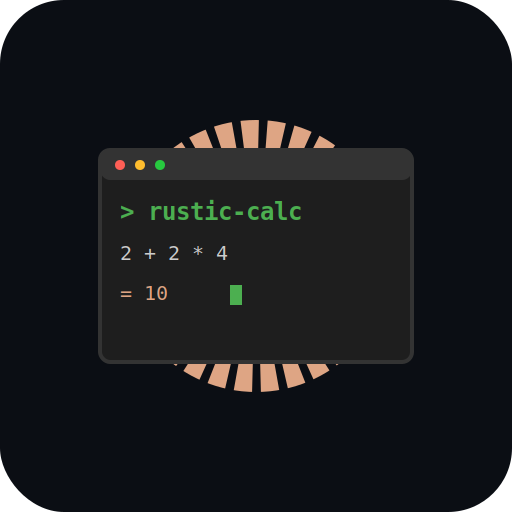

# 🦀 rustic-calc

<p align="center">
  
</p>

[](https://github.com/marc-niclas/rustic-calc/actions/workflows/ci.yml)
[](https://opensource.org/licenses/MIT)

A fast terminal calculator written in Rust. `rustic-calc` provides a keyboard-driven TUI for evaluating expressions, storing variables, reviewing history, and plotting expressions with one unknown variable.

## ✨ Features

- **Interactive TUI** built with `ratatui`
- **Three panes** for input, history, and variables
- **Vim-style input editor** with `Insert`, `Normal`, and `Visual` modes
- **Expression evaluation** with operator precedence for:
  - `+`, `-`, `*`, `/`, `^`
- **Parentheses support** for grouped expressions (including nested groups)
- **Unary minus** support for negative values
- **Variables** via assignment syntax (`x=2+3`) and reuse in later expressions
- **Implicit multiplication** support (`7x` becomes `7*x`, `2(a+b)` becomes `2*(a+b)`)
- **History recall and selection** from the history pane
- **Automatic scatter plotting** for expressions with exactly one unknown variable (sampled from `-10` to `10`)
- **Inline error reporting** for parse/evaluation issues

## 🚀 Getting Started

### Prerequisites

- [Rust](https://www.rust-lang.org/tools/install) (2024 edition)

### Installation

Clone the repository and build the project using Cargo:

```bash
git clone https://github.com/marc-niclas/rustic-calc.git
cd rustic-calc
cargo install --path .
```

### Usage

Run the calculator:

```bash
rcalc run
```

### Expression examples

```text
3*4-1
b=2
a=b+5
7x+a        # plots y = 7x + a for x in [-10, 10]
2(a+b)      # implicit multiplication with parentheses
```

### Controls

#### Global

| Key | Action |
|-----|--------|
| `Ctrl+C` | Quit application |

#### Input pane

| Key | Action |
|-----|--------|
| `Enter` | Submit expression |
| `Esc` | Switch from Insert to Normal mode |
| `Up Arrow` | Recall last expression (Insert mode) |
| `Backspace` | Delete previous character (Insert mode) |
| `Left` / `Right` | Move cursor (Insert mode) |

#### Normal mode (input pane)

| Key | Action |
|-----|--------|
| `i` / `a` / `I` / `A` | Enter Insert mode (Vim-style) |
| `h` / `l` or `Left` / `Right` | Move cursor |
| `w` / `b` | Word motions |
| `0` / `$` | Line start / line end |
| `x` | Delete character under cursor |
| `v` | Enter Visual mode |
| `p` / `P` | Paste yanked text after / before cursor |
| `Tab` / `Shift+Tab` | Cycle focus: Input -> History -> Variables |

#### History and Variables panes

| Key | Action |
|-----|--------|
| `Up` / `Down` | Move selection |
| `Enter` | Load selected item into input |
| `i` | Return to input Insert mode |
| `Tab` / `Shift+Tab` | Cycle focus |
| `Left` / `Right` | Jump focus between History and Variables |

## 🧪 Testing

The project includes unit and integration tests for calculation, tokenization, variables, editor behavior, and TUI interactions.

```bash
cargo test
```

## 🛠️ Development

This project uses `pre-commit` to ensure code quality.

1. Install pre-commit hooks:
   ```bash
   pre-commit install
   ```
2. The CI pipeline runs `clippy` and `rustfmt` on every push.

### Project Structure

- `src/main.rs`: Application entrypoint
- `src/tui_app.rs`: TUI state, key handling, and rendering orchestration
- `src/input_editor.rs`: Vim-style line editor logic
- `src/calculate.rs`: Expression evaluation
- `src/tokenize.rs`: Tokenization and implicit multiplication
- `src/variables.rs`: Variable assignment parsing
- `src/widgets/`: TUI pane widgets (help, input, history, variables, plot)
- `tests/`: Integration tests for calculator and TUI behavior

## 📜 License

Distributed under the MIT License. See `LICENSE` for more information.

---
Built with Rust and Ratatui.
